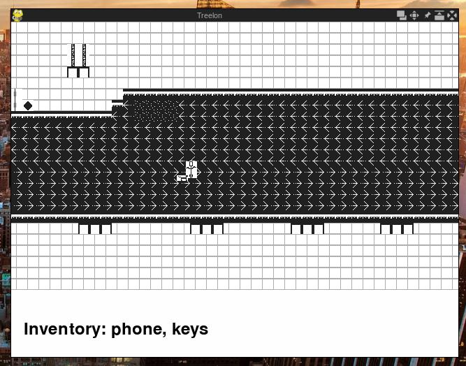

# Treelon Game

 a role playing adventure simulation game with augmented reality elements about bv becomming a tech billionaire set in NYC
 

## Inspirations
- Minecraft
- Pokemon
- His Dark Materials (Golden Compass)

## Starting Worlds (multiple choices)
- Waypoint Cafe
- NYC studio kuberlog's starting
- Washington DC (politics profession)
- Yacht
- EarthShip (rockies)

## World Generation
- Use satalite images to genearte worlds

## Quests
- "The Nug Quest": may become infamous. It will be an in game quest where the reward for completing it will be a nugget of legal NYC weed. Of course, the user must be in NYC to do the quest.
